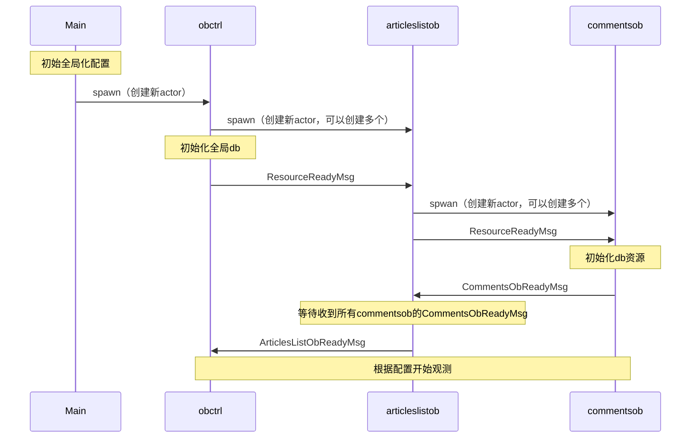
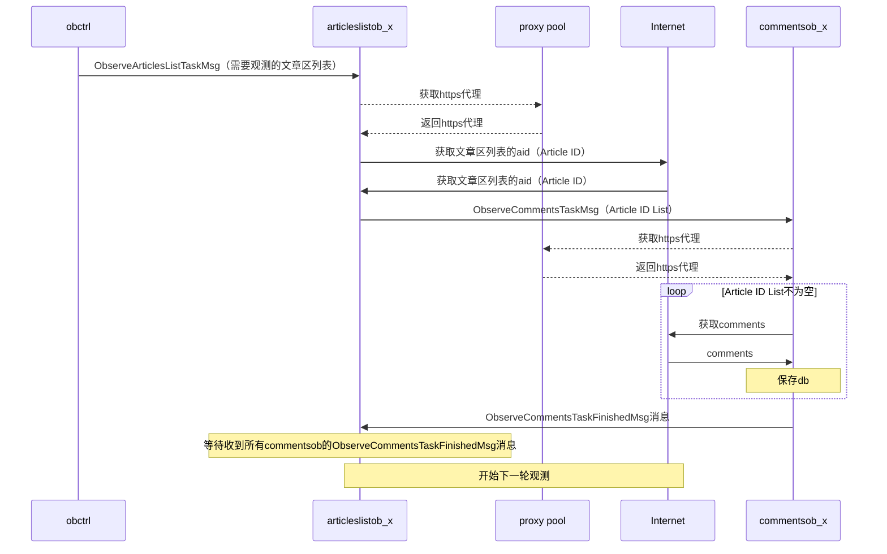
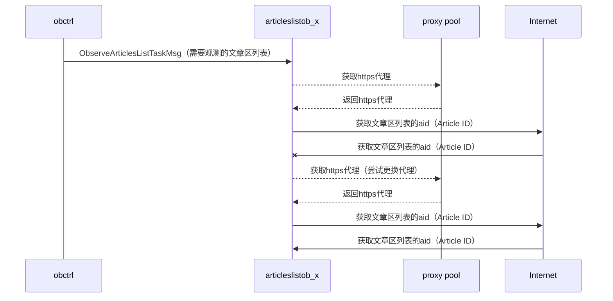

# AcFun Comments Observer Backend
A站评论观察者后端，尽可能完整收录A站文章区下所有评论，无外部访问功能，需搭配独立WEB端进行查询数据。

WEB端Repo请访问这里：[LINK](https://github.com/WangHongshuo/acfun_comments_observer_web)

## 在线预览

http://47.100.72.81:5000 （丐中丐配置，勿压测）

## 依赖

- 数据库
- [proxy_pool](https://github.com/jhao104/proxy_pool)（可选）

## 使用组件

- gorm
- protoactor-go
- zap
- vipper

## Actor结构

```
Main
├── HttpServer(ToDo)
├── obctrl (ObserverController)
    ├── articleslistob (ArticlesListObserver)
        ├── commentsob (CommentsObserver)
```

## 业务流程

### 启动流程



### 运行流程



### 异常流程



